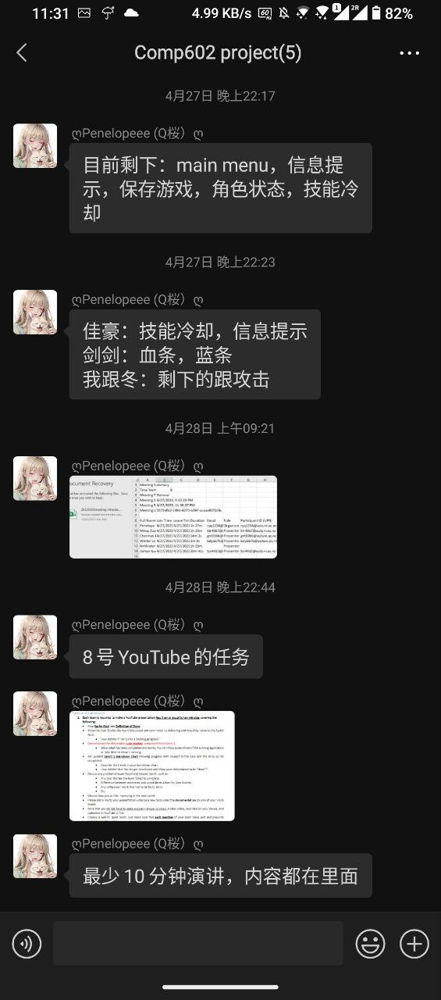
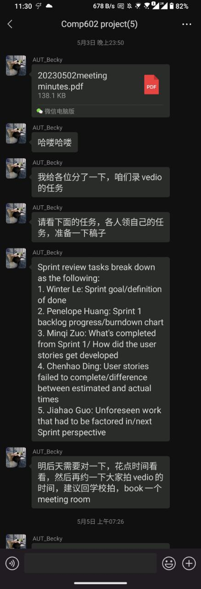

<h3><b>Develop task assigned:</b></h3>
<h4>27/Apr/2023<h4>

<h4>
Develop task assignment: 
<table border="1">
<tr><td>1.</td><td>Jiahao</td><td>Skill cooldown, Hint system.</td></tr>
<tr><td>2.</td><td>Chenhao</td><td>HP bar, MP bar.</td></tr>
<tr><td>3.</td><td>Minqi</td><td> Movement, Advanced jumping.</td></tr>
<tr><td rowspan="2">4 & 5.</td><td rowspan="2">Winter & Penelope</td><td>Main menu, Game saving, </td></tr>
<tr><td>Attack, Enemies.</td><tr>
</table>
</h4>
 
<h3><b>Sprint 1 Task break down:</b></h3>
<h4>03/May/2023<h4>

 
<h4>
For video of presentatio: 
<table border="1">
<tr><td>1.</td><td>Winter</td><td>Sprint goal, definition of done.</td></tr>
<tr><td>2.</td><td>Penelope</td><td>Sprint 1 backlog progress, burndown chart.</td></tr>
<tr><td>3.</td><td>Minqi</td><td> What's completed from Sprint 1, How did the user stories get developed.</td></tr>
<tr><td>4.</td><td>Chenhao</td><td>User stories failed to complete, difference between estimated and actual time.</td></tr>
<tr><td>5.</td><td>Jiahao</td><td>Unforeseen work that had to be factored in, next Sprint perspective.</td><tr>
</table>
</h4>